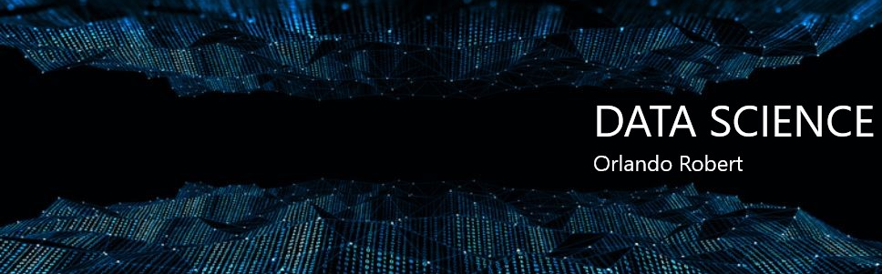

  

# Orlando Robert
*Data Scientist Intern* at Bayer

As a Data Scientist I combine analytical skills, ability to work in team environments, and attention to details.

I am a student of Electrical Engeneering at FMU and I am also studying programming languages to be a exceptional data scientist. In 2016 I certified in Maintenance Electrician at SENAI

**Background in:** Python, AWS, AUTOCAD.

**Links:**
* [LinkedIn](https://www.linkedin.com/in/orlando-robert)

## Projetos:

* **Análise de dados - Airbnb (Toronto):** [bit.ly/33BJJbl](bit.ly/33BJJbl)
* **Análise de dados - Violência no RJ:** [bit.ly/3c4h5nf](bit.ly/3c4h5nf)

---

